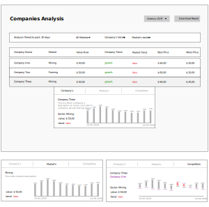

# Analysis App

## Basic Schema


## Features List
* Support localization for price values
* Support for currency calculations
* Market analysis for 30 days in past.
* Trend analysis based on the last 7 days data.
* Detailed company, market and competitor analysis, according user's demad (click)
* Download of report based on visualized data.

## API
Start the server running `yarn backend` or `npm run backend`
  
### Companies
```shell script
 curl http://localhost:3030/companies

[
  {
    "id":0,
    "name":"Avocado Purple",
    "market":0,
    "description":"Lorem ipsum dolo...
  },
]  
```

### Markets
```shell script
curl http://localhost:3030/markets

[
  {
    "id":0,
    "name":"Energy",
    "description":"Lorem ipsum",
  },
]
```

### Company Prices
```shell script
curl http://localhost:3030/company/1/prices

{
  "company": 1,
  "prices": [
    {"2020-09-06": 32.999},
  ],
}
```

### Market prices
```shell script
curl http://localhost:3030/market/1/prices

{
  "market":1,
  "prices":[
    {"2020-09-06":7.781249999999999},
  ]
}
```